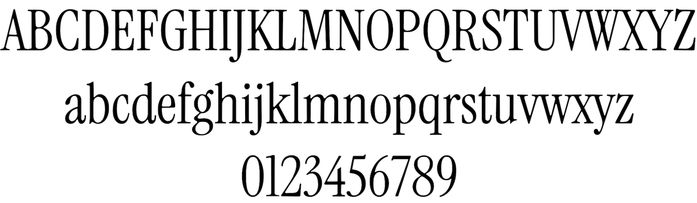

# Clear Fantastic Serif

Clear Fantastic Serif is a condensed, display serif font that has been designed for open-source usage, making it ideal for web-based and application design.

## Language support

This font contains 374 Latin glyphs that support 86 different languages, including Afrikaans, Albanian, Asu, Basque, Bemba, Bena, Breton, Catalan, Chiga, Colognian, Cornish, Croatian, Czech, Danish, Dutch, English, Estonian, Faroese, Filipino, Finnish, French, Friulian, Galician, Ganda, German, Gusii, Hungarian, Inari Sami, Indonesian, Irish, Italian, Jola-Fonyi, Kabuverdianu, Kalenjin, Kinyarwanda, Latvian, Lithuanian, Lower Sorbian, Luo, Luxembourgish, Luyia, Machame, Makhuwa-Meetto, Makonde, Malagasy, Maltese, Manx, Morisyen, North Ndebele, Norwegian Bokmål, Norwegian Nynorsk, Nyankole, Oromo, Polish, Portuguese, Quechua, Romanian, Romansh, Rombo, Rundi, Rwa, Samburu, Sango, Sangu, Scottish Gaelic, Sena, Serbian, Shambala, Shona, Slovak, Soga, Somali, Spanish, Swahili, Swedish, Swiss German, Taita, Teso, Turkish, Upper Sorbian, Uzbek (Latin), Volapük, Vunjo, Welsh, Western Frisian, and Zulu.

## Acknowledgements

Clear Fantastic Serif was designed by Junjie.

## License

This font is licensed under the SIL Open Font License, Version 1.1, which is available with a FAQ at https://scripts.sil.org/OFL.

